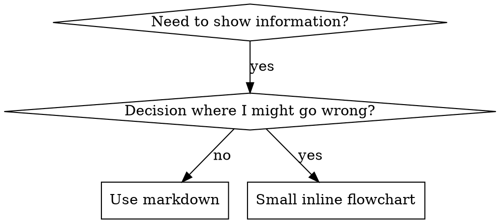

# Writing Skills

## Overview

**Writing skills IS Test-Driven Development applied to process documentation.**

**Personal skills live in agent-specific directories (`~/.claude/skills` for Claude Code, `~/.codex/skills` for Codex)**

You write test cases (pressure scenarios with subagents), watch them fail (baseline behavior), write the skill (documentation), watch tests pass (agents comply), and refactor (close loopholes).

**Core principle:** If you didn't watch an agent fail without the skill, you don't know if the skill teaches the right thing.

**REQUIRED BACKGROUND:** Invoke `Skill(test-driven-development)` first. This skill adapts TDD to documentation.

---

# 1. Foundation

## What is a Skill?

A **skill** is a reference guide for proven techniques, patterns, or tools. Skills help future Claude instances find and apply effective approaches.

**Skills are:** Reusable techniques, patterns, tools, reference guides

**Skills are NOT:** Narratives about how you solved a problem once

## Skill Types

| Type | Description | Examples |
|------|-------------|----------|
| **Discipline** | Rules/constraints to enforce | TDD, verification-before-completion |
| **Technique** | Concrete method with steps | condition-based-waiting, root-cause-tracing |
| **Pattern** | Way of thinking about problems | flatten-with-flags, test-invariants |
| **Reference** | API docs, syntax guides, tool docs | office docs, library guides |

## When to Create a Skill

**Create when:**
- Technique wasn't intuitively obvious to you
- You'd reference this again across projects
- Pattern applies broadly (not project-specific)
- Others would benefit

**Don't create for:**
- One-off solutions
- Standard practices well-documented elsewhere
- Project-specific conventions (put in CLAUDE.md)
- Mechanical constraints (automate with regex/validation instead)

---

# 2. Structure

## Directory Structure

```
skills/
  skill-name/
    SKILL.md              # Main reference (required)
    scripts/              # Executable code (optional)
    references/           # Docs loaded into context as needed (optional)
    assets/               # Files used in output, never loaded (optional)
```

**Flat namespace** - all skills in one searchable namespace

### Bundled Resources Taxonomy

| Directory | Purpose | When to Use | Context Impact |
|-----------|---------|-------------|----------------|
| `scripts/` | Executable code (Python/Bash) | Same code rewritten repeatedly, deterministic reliability needed | Can execute without loading |
| `references/` | Documentation for Claude to read | Schemas, API docs, domain knowledge Claude needs while working | Loaded on demand |
| `assets/` | Files used in output | Templates, images, boilerplate copied to output | Never loaded into context |

**Keep inline in SKILL.md:**
- Principles and concepts
- Code patterns (< 50 lines)
- Core workflow instructions

**Separate into files:**
- Heavy reference (100+ lines)
- Reusable scripts/utilities
- Templates and assets

## SKILL.md Structure

**Frontmatter (YAML):**
- Only two fields supported: `name` and `description`
- Max 1024 characters total
- `name`: Use letters, numbers, and hyphens only (no parentheses, special chars)
- `description`: Third-person, describes ONLY when to use (NOT what it does)
  - Start with "Use when..." to focus on triggering conditions
  - Include specific symptoms, situations, and contexts
  - **NEVER summarize the skill's process or workflow** (see CSO section for why)
  - Keep under 500 characters if possible

```markdown
---
name: Skill-Name-With-Hyphens
description: Use when [specific triggering conditions and symptoms]
---

# Skill Name

## Overview
What is this? Core principle in 1-2 sentences.

## When to Use
[Small inline flowchart IF decision non-obvious]

Bullet list with SYMPTOMS and use cases

## When NOT to Use                          # All types, required for Pattern
Skip when:
- [condition where this doesn't apply]
- [counter-example scenario]

## Core Constraints                          # Discipline only
NEVER [action] unless the user explicitly requests it.

## Steps                                     # Technique only
**Step 1: [Action]**
[WHY: Reason this step matters]

**Step 2: [Action]**
[WHY: Reason this step matters]

## Core Pattern                              # Pattern/Technique
Before/after code comparison

## Output Format                             # Reference only
ALWAYS use this exact structure:
[template with placeholders]

## Quick Reference
Table or bullets for scanning common operations

## Examples

<good-example>
[Correct behavior with context]
</good-example>

<bad-example>
[Incorrect behavior]
**Why bad:** [explanation]
</bad-example>

## Implementation
Inline code for simple patterns
Link to file for heavy reference or reusable tools

## Bundled Resources                         # When skill has references/scripts/assets

| Resource | When to Load | Why |
|----------|--------------|-----|
| `references/api.md` | When using [specific feature] | [API details too large for inline] |
| `scripts/validate.py` | Before [specific action] | [Validates X to prevent Y] |
| `assets/template.docx` | When generating output | [Base template for output] |

## Common Mistakes
What goes wrong + fixes

## Common Rationalizations                   # Discipline only
| Rationalization | Why It's WRONG | Required Action |
|-----------------|----------------|-----------------|
| "excuse text" | explanation | **BOLD DIRECTIVE** |

## Red Flags - STOP                          # Discipline only
- [Sign you're about to violate the rule]
- [Another warning sign]

**All of these mean: [Required action]**
```

**Section applicability by skill type:**

| Section | Discipline | Technique | Pattern | Reference |
|---------|------------|-----------|---------|-----------|
| Overview | ✓ | ✓ | ✓ | ✓ |
| When to Use | ✓ | ✓ | ✓ | ✓ |
| When NOT to Use | ✓ | ✓ | **Required** | ✓ |
| Core Constraints | **Required** | - | - | - |
| Steps (with WHY) | - | **Required** | - | - |
| Core Pattern | - | ✓ | **Required** | - |
| Output Format | - | - | - | **Required** |
| Quick Reference | ✓ | ✓ | ✓ | ✓ |
| Examples (Good/Bad) | **Required** | **Required** | ✓ | **Required** |
| Implementation | ✓ | ✓ | ✓ | ✓ |
| Bundled Resources | If has refs/scripts | If has refs/scripts | If has refs/scripts | If has refs/scripts |
| Common Mistakes | ✓ | ✓ | ✓ | ✓ |
| Rationalizations | **Required** | - | - | - |
| Red Flags | **Required** | - | - | - |

## Progressive Disclosure

Skills use a three-level loading system to manage context:

1. **Metadata** (name + description) - Always in context (~100 words)
2. **SKILL.md body** - When skill triggers (<500 lines target)
3. **Bundled resources** - As needed by Claude

**Key principle:** When approaching 500 lines, split content. Reference files from SKILL.md with clear guidance on when to read them.

### Progressive Disclosure Patterns

**Pattern 1: High-level guide with references**
```markdown
## Advanced features
- **Form filling**: See references/forms.md for complete guide
- **API reference**: See references/api.md for all methods
```
Claude loads reference files only when needed.

**Pattern 2: Domain-specific organization**
```
bigquery-skill/
├── SKILL.md (overview and navigation)
└── references/
    ├── finance.md
    ├── sales.md
    └── product.md
```
User asks about sales → Claude only reads sales.md.

**Pattern 3: Conditional details**
```markdown
For simple edits, modify XML directly.
**For tracked changes**: See references/redlining.md
```

### Directory Examples

**Self-Contained Skill**
```
defense-in-depth/
  SKILL.md    # Everything inline
```
When: All content fits, no heavy reference needed

**Skill with Reusable Tool**
```
condition-based-waiting/
  SKILL.md    # Overview + patterns
  example.ts  # Working helpers to adapt
```
When: Tool is reusable code, not just narrative

**Skill with Heavy Reference**
```
pptx/
  SKILL.md       # Overview + workflows
  references/
    pptxgenjs.md # 600 lines API reference
    ooxml.md     # 500 lines XML structure
  scripts/       # Executable tools
```
When: Reference material too large for inline

---

# 3. Writing Content

## Degrees of Freedom

Match specificity to task fragility. Narrow bridge needs guardrails, open field allows many routes.

| Level | When to Use | Example |
|-------|-------------|---------|
| **High** (text instructions) | Multiple valid approaches, context-dependent decisions | "Choose appropriate error handling for the context" |
| **Medium** (pseudocode/scripts with params) | Preferred pattern exists, some variation acceptable | "Use this template, adjust X and Y for your case" |
| **Low** (specific scripts, few params) | Fragile operations, consistency critical, exact sequence required | "Run exactly these commands in order" |

**Default assumption:** Claude is smart. Only add context Claude doesn't already have.

## Instruction Patterns

Effective skills use specific instruction patterns that Claude reliably follows.

### Core Patterns

#### 1. Absolute + Exception

For behavioral constraints with escape hatches:

```markdown
NEVER [action] unless the user explicitly requests it.
```

**When to use:** Discipline skills, safety constraints, default behaviors

<good-example>
NEVER commit changes unless the user explicitly asks you to.
</good-example>

<bad-example>
Try not to commit changes without asking.
**Why bad:** "Try not to" is weak - Claude may rationalize exceptions
</bad-example>

#### 2. Good/Bad Example Pairs

Show correct AND incorrect behavior:

```markdown
<good-example>
[correct behavior with context]
</good-example>

<bad-example>
[incorrect behavior]
**Why bad:** [explanation]
</bad-example>
```

**When to use:** Any skill where mistakes are common or subtle

#### 3. Reasoning Blocks

Explain WHY, not just WHAT:

```markdown
<reasoning>
The assistant used X because:
1. [reason 1]
2. [reason 2]
</reasoning>
```

**When to use:** Complex decisions, non-obvious choices

#### 4. Decision Trees

Explicit when/when-not sections:

```markdown
## When to Use
Use when ANY of these apply:
- [condition 1]
- [condition 2]

## When NOT to Use
Skip when:
- [condition 1]
- [condition 2]
```

**When to use:** Skills with ambiguous applicability

#### 5. Output Templates

Exact format with placeholders:

```markdown
## Output Format
ALWAYS use this exact structure:
[template with placeholders]
```

**When to use:** Reference skills, skills producing structured output

### Required Patterns by Skill Type

| Skill Type | Required Patterns |
|------------|-------------------|
| **Discipline** | Absolute + Exception, Good/Bad Examples, Rationalization Table |
| **Technique** | Decision Tree, Good/Bad Examples, Step-by-step with WHY |
| **Pattern** | Recognition examples, Counter-examples (when NOT to apply) |
| **Reference** | Output Templates, Exact syntax examples |

### Pattern Checklist

**Discipline Skills MUST include:**
- [ ] At least one Absolute + Exception constraint
- [ ] Good/Bad example pair showing violation vs compliance
- [ ] Rationalization table with Required Action column

**Technique Skills MUST include:**
- [ ] Decision tree (When to Use / When NOT to Use)
- [ ] At least one Good/Bad example pair
- [ ] Steps with reasoning (WHY each step matters)

**Pattern Skills MUST include:**
- [ ] Recognition examples (how to spot when pattern applies)
- [ ] Counter-examples (when pattern does NOT apply)

**Reference Skills MUST include:**
- [ ] Output template with exact format
- [ ] At least one complete usage example

## Content Guidelines

### Consistent Terminology

Choose ONE term, use throughout:

| Good (Consistent) | Bad (Inconsistent) |
|-------------------|-------------------|
| Always "API endpoint" | Mix "endpoint", "URL", "route", "path" |
| Always "field" | Mix "field", "box", "element", "control" |
| Always "extract" | Mix "extract", "pull", "get", "retrieve" |

### Avoid Time-Sensitive Information

<bad-example>
If you're doing this before August 2025, use the old API.
After August 2025, use the new API.
**Why bad:** Will become wrong, confuses Claude
</bad-example>

<good-example>
## Current method
Use the v2 API endpoint: `api.example.com/v2/messages`

## Old patterns
<details>
<summary>Legacy v1 API (deprecated)</summary>
The v1 API used: `api.example.com/v1/messages`
This endpoint is no longer supported.
</details>
</good-example>

### Test With All Models

Skills act as additions to models. Test with all models you plan to use:

| Model | Consideration |
|-------|---------------|
| **Haiku** | Does skill provide enough guidance? May need more detail |
| **Sonnet** | Is skill clear and efficient? |
| **Opus** | Does skill avoid over-explaining? May need less detail |

## Code Examples

**One excellent example beats many mediocre ones**

Choose most relevant language:
- Testing techniques → TypeScript/JavaScript
- System debugging → Shell/Python
- Data processing → Python

**Good example:**
- Complete and runnable
- Well-commented explaining WHY
- From real scenario
- Shows pattern clearly
- Ready to adapt (not generic template)

**Don't:**
- Implement in 5+ languages
- Create fill-in-the-blank templates
- Write contrived examples

You're good at porting - one great example is enough.

## Flowchart Usage



**Use flowcharts ONLY for:**
- Non-obvious decision points
- Process loops where you might stop too early
- "When to use A vs B" decisions

**Never use flowcharts for:**
- Reference material → Tables, lists
- Code examples → Markdown blocks
- Linear instructions → Numbered lists
- Labels without semantic meaning (step1, helper2)

See @graphviz-conventions.dot for graphviz style rules.

**Visualizing for your human partner:** Use `render-graphs.js` in this directory to render a skill's flowcharts to SVG:
```bash
./render-graphs.js ../some-skill           # Each diagram separately
./render-graphs.js ../some-skill --combine # All diagrams in one SVG
```

## Workflows & Feedback Loops

### Checklist Pattern for Complex Tasks

For multi-step workflows, provide a copyable checklist:

````markdown
## Form filling workflow

Copy this checklist and track progress:

```
Task Progress:
- [ ] Step 1: Analyze the form
- [ ] Step 2: Create field mapping
- [ ] Step 3: Validate mapping
- [ ] Step 4: Fill the form
- [ ] Step 5: Verify output
```

**Step 1: Analyze the form**
Run: `python scripts/analyze_form.py input.pdf`
[WHY: Extracts field locations before we can fill them]

**Step 2: Create field mapping**
...
````

**Why checklists work:** Claude can copy into response, check off items, prevents skipping steps.

### Feedback Loops

**Pattern:** Run validator → fix errors → repeat

```markdown
## Document editing process

1. Make edits to `document.xml`
2. **Validate immediately**: `python validate.py`
3. If validation fails:
   - Review error message
   - Fix the issue
   - Run validation again
4. **Only proceed when validation passes**
5. Rebuild document
```

**When to use:** Batch operations, destructive changes, high-stakes operations.

## Scripts Best Practices

**For skills with executable code.**

### Solve, Don't Punt

Handle errors in scripts rather than failing to Claude:

<good-example>
```python
def process_file(path):
    try:
        with open(path) as f:
            return f.read()
    except FileNotFoundError:
        print(f"File {path} not found, creating default")
        with open(path, 'w') as f:
            f.write('')
        return ''
```
</good-example>

<bad-example>
```python
def process_file(path):
    return open(path).read()  # Just fail, let Claude figure it out
```
**Why bad:** Punts problem to Claude instead of solving it
</bad-example>

### No Magic Numbers

```python
# ✅ GOOD: Self-documenting
REQUEST_TIMEOUT = 30  # HTTP requests typically complete within 30s
MAX_RETRIES = 3       # Most intermittent failures resolve by second retry

# ❌ BAD: Magic numbers
TIMEOUT = 47  # Why 47?
RETRIES = 5   # Why 5?
```

### Utility Scripts Benefits

Even if Claude could write a script, pre-made scripts:
- More reliable than generated code
- Save tokens (no code in context)
- Save time (no generation)
- Ensure consistency

### Verifiable Intermediate Outputs

For complex tasks, create plan file → validate → execute:

```
analyze → create changes.json → validate changes.json → apply → verify
```

**Why:** Catches errors early, machine-verifiable, reversible planning.

---

# 4. TDD Process

## TDD Mapping for Skills

| TDD Concept | Skill Creation |
|-------------|----------------|
| **Test case** | Pressure scenario with subagent |
| **Production code** | Skill document (SKILL.md) |
| **Test fails (RED)** | Agent violates rule without skill (baseline) |
| **Test passes (GREEN)** | Agent complies with skill present |
| **Refactor** | Close loopholes while maintaining compliance |
| **Write test first** | Run baseline scenario BEFORE writing skill |
| **Watch it fail** | Document exact rationalizations agent uses |
| **Minimal code** | Write skill addressing those specific violations |
| **Watch it pass** | Verify agent now complies |
| **Refactor cycle** | Find new rationalizations → plug → re-verify |

The entire skill creation process follows RED-GREEN-REFACTOR.

## The Iron Law

```
NO SKILL WITHOUT A FAILING TEST FIRST
```

This applies to NEW skills AND EDITS to existing skills.

Write skill before testing? Delete it. Start over.
Edit skill without testing? Same violation.

**No exceptions:**
- Not for "simple additions"
- Not for "just adding a section"
- Not for "documentation updates"
- Don't keep untested changes as "reference"
- Don't "adapt" while running tests
- Delete means delete

**REQUIRED BACKGROUND:** Invoke `Skill(test-driven-development)` if unfamiliar. Same principles apply to documentation.

## RED-GREEN-REFACTOR for Skills

### RED: Write Failing Test (Baseline)

Run pressure scenario with subagent WITHOUT the skill. Document exact behavior:
- What choices did they make?
- What rationalizations did they use (verbatim)?
- Which pressures triggered violations?

This is "watch the test fail" - you must see what agents naturally do before writing the skill.

### GREEN: Write Minimal Skill

**REQUIRED:** Follow the Instruction Patterns and Content Guidelines sections above.

Write skill that addresses those specific rationalizations. Don't add extra content for hypothetical cases.

Run same scenarios WITH skill. Agent should now comply.

### REFACTOR: Close Loopholes

Agent found new rationalization? Add explicit counter. Re-test until bulletproof.

**Testing methodology:** Use `Skill(testing-skills-with-subagents)` for the complete testing methodology.
**IMPORTANT:** `testing-skills-with-subagents` is a **Skill**, NOT a Task subagent. Invoke it with `Skill(testing-skills-with-subagents)`, NEVER with `Task(subagent_type=...)`.
- How to write pressure scenarios
- Pressure types (time, sunk cost, authority, exhaustion)
- Plugging holes systematically
- Meta-testing techniques

## Testing All Skill Types

Different skill types need different test approaches:

### Discipline-Enforcing Skills (rules/requirements)

**Examples:** TDD, verification-before-completion, designing-before-coding

**Test with:**
- Academic questions: Do they understand the rules?
- Pressure scenarios: Do they comply under stress?
- Multiple pressures combined: time + sunk cost + exhaustion
- Identify rationalizations and add explicit counters

**Success criteria:** Agent follows rule under maximum pressure

### Technique Skills (how-to guides)

**Examples:** condition-based-waiting, root-cause-tracing, defensive-programming

**Test with:**
- Application scenarios: Can they apply the technique correctly?
- Variation scenarios: Do they handle edge cases?
- Missing information tests: Do instructions have gaps?

**Success criteria:** Agent successfully applies technique to new scenario

### Pattern Skills (mental models)

**Examples:** reducing-complexity, information-hiding concepts

**Test with:**
- Recognition scenarios: Do they recognize when pattern applies?
- Application scenarios: Can they use the mental model?
- Counter-examples: Do they know when NOT to apply?

**Success criteria:** Agent correctly identifies when/how to apply pattern

### Reference Skills (documentation/APIs)

**Examples:** API documentation, command references, library guides

**Test with:**
- Retrieval scenarios: Can they find the right information?
- Application scenarios: Can they use what they found correctly?
- Gap testing: Are common use cases covered?

**Success criteria:** Agent finds and correctly applies reference information

## Common Rationalizations for Skipping Testing

| Rationalization | Why It's WRONG | Required Action |
|-----------------|----------------|-----------------|
| "Skill is obviously clear" | Clear to you ≠ clear to other agents. Test it. | **Test before deploying** |
| "It's just a reference" | References can have gaps, unclear sections. Test retrieval. | **Test retrieval scenarios** |
| "Testing is overkill" | Untested skills have issues. Always. 15 min testing saves hours. | **Always test** |
| "I'll test if problems emerge" | Problems = agents can't use skill. Test BEFORE deploying. | **Test before deploying** |
| "Too tedious to test" | Testing is less tedious than debugging bad skill in production. | **Test now, not later** |
| "I'm confident it's good" | Overconfidence guarantees issues. Test anyway. | **Test despite confidence** |
| "Academic review is enough" | Reading ≠ using. Test application scenarios. | **Test application scenarios** |
| "No time to test" | Deploying untested skill wastes more time fixing it later. | **Allocate testing time** |

**All of these mean: Test before deploying. No exceptions.**

## Bulletproofing Skills Against Rationalization

Skills that enforce discipline (like TDD) need to resist rationalization. Agents are smart and will find loopholes when under pressure.

**Psychology note:** Understanding WHY persuasion techniques work helps you apply them systematically. See references/persuasion-principles.md for research foundation (Cialdini, 2021; Meincke et al., 2025) on authority, commitment, scarcity, social proof, and unity principles.

### Close Every Loophole Explicitly

Don't just state the rule - forbid specific workarounds:

<Bad>
```markdown
Write code before test? Delete it.
```
</Bad>

<Good>
```markdown
Write code before test? Delete it. Start over.

**No exceptions:**
- Don't keep it as "reference"
- Don't "adapt" it while writing tests
- Don't look at it
- Delete means delete
```
</Good>

### Address "Spirit vs Letter" Arguments

Add foundational principle early:

```markdown
**Violating the letter of the rules is violating the spirit of the rules.**
```

This cuts off entire class of "I'm following the spirit" rationalizations.

### Build Rationalization Table

Capture rationalizations from baseline testing. Every excuse agents make goes in the table. Use the 3-column Ring pattern:

```markdown
| Rationalization | Why It's WRONG | Required Action |
|-----------------|----------------|-----------------|
| "Too simple to test" | Simple code breaks. Test takes 30 seconds. | **Write test first** |
| "I'll test after" | Tests passing immediately prove nothing. | **Test before writing code** |
| "Tests after achieve same goals" | Tests-after = "what does this do?" Tests-first = "what should this do?" | **Always use TDD** |
```

### Rationalization Tables (Required for Discipline Skills)

Every skill that enforces a discipline MUST include an anti-rationalization table using the 3-column Ring pattern:

| Rationalization | Why It's WRONG | Required Action |
|-----------------|----------------|-----------------|
| "excuse text" | explanation why wrong | **BOLD DIRECTIVE** |

**The three columns serve different purposes:**

- **Column 1 (Rationalization):** The excuse or rationalization agents will use under pressure
- **Column 2 (Why It's WRONG):** Concise explanation of why that excuse fails
- **Column 3 (Required Action):** A bold, actionable directive that turns documentation into enforceable guidance

**The Required Action column is critical** - it transforms a rationalization table from descriptive documentation into prescriptive guidance. The bold text makes the directive stand out and serves as a concrete action statement that agents can follow.

**Examples:**
- ✅ **Write test first** (not: "should write test")
- ✅ **Test before deploying** (not: "testing is recommended")
- ✅ **Delete and start over** (not: "consider restarting")

This pattern applies to all discipline-enforcing skills like test-driven-development, verification-before-completion, and designing-before-coding.

### Create Red Flags List

Make it easy for agents to self-check when rationalizing:

```markdown
## Red Flags - STOP and Start Over

- Code before test
- "I already manually tested it"
- "Tests after achieve the same purpose"
- "It's about spirit not ritual"
- "This is different because..."

**All of these mean: Delete code. Start over with TDD.**
```

### Update CSO for Violation Symptoms

Add to description: symptoms of when you're ABOUT to violate the rule:

```yaml
description: use when implementing any feature or bugfix, before writing implementation code
```

---

# 5. Discovery

## Claude Search Optimization (CSO)

**Critical for discovery:** Future Claude needs to FIND your skill

### 1. Rich Description Field

**Purpose:** Claude reads description to decide which skills to load for a given task. Make it answer: "Should I read this skill right now?"

**Format:** Start with "Use when..." to focus on triggering conditions

**CRITICAL: Description = When to Use, NOT What the Skill Does**

The description should ONLY describe triggering conditions. Do NOT summarize the skill's process or workflow in the description.

**Why this matters:** Testing revealed that when a description summarizes the skill's workflow, Claude may follow the description instead of reading the full skill content. A description saying "code review between tasks" caused Claude to do ONE review, even though the skill's flowchart clearly showed TWO reviews (spec compliance then code quality).

When the description was changed to just "Use when executing implementation plans with independent tasks" (no workflow summary), Claude correctly read the flowchart and followed the two-stage review process.

**The trap:** Descriptions that summarize workflow create a shortcut Claude will take. The skill body becomes documentation Claude skips.

```yaml
# ❌ BAD: Summarizes workflow - Claude may follow this instead of reading skill
description: Use when executing plans - dispatches subagent per task with code review between tasks

# ❌ BAD: Too much process detail
description: Use for TDD - write test first, watch it fail, write minimal code, refactor

# ✅ GOOD: Just triggering conditions, no workflow summary
description: Use when executing implementation plans with independent tasks in the current session

# ✅ GOOD: Triggering conditions only
description: Use when implementing any feature or bugfix, before writing implementation code
```

**Content:**
- Use concrete triggers, symptoms, and situations that signal this skill applies
- Describe the *problem* (race conditions, inconsistent behavior) not *language-specific symptoms* (setTimeout, sleep)
- Keep triggers technology-agnostic unless the skill itself is technology-specific
- If skill is technology-specific, make that explicit in the trigger
- Write in third person (injected into system prompt)
- **NEVER summarize the skill's process or workflow**

```yaml
# ❌ BAD: Too abstract, vague, doesn't include when to use
description: For async testing

# ❌ BAD: First person
description: I can help you with async tests when they're flaky

# ❌ BAD: Mentions technology but skill isn't specific to it
description: Use when tests use setTimeout/sleep and are flaky

# ✅ GOOD: Starts with "Use when", describes problem, no workflow
description: Use when tests have race conditions, timing dependencies, or pass/fail inconsistently

# ✅ GOOD: Technology-specific skill with explicit trigger
description: Use when using React Router and handling authentication redirects
```

### 2. Keyword Coverage

Use words Claude would search for:
- Error messages: "Hook timed out", "ENOTEMPTY", "race condition"
- Symptoms: "flaky", "hanging", "zombie", "pollution"
- Synonyms: "timeout/hang/freeze", "cleanup/teardown/afterEach"
- Tools: Actual commands, library names, file types

### 3. Descriptive Naming

**Use active voice, verb-first:**
- ✅ `creating-skills` not `skill-creation`
- ✅ `condition-based-waiting` not `async-test-helpers`

**Name by what you DO or core insight:**
- ✅ `condition-based-waiting` > `async-test-helpers`
- ✅ `using-skills` not `skill-usage`
- ✅ `flatten-with-flags` > `data-structure-refactoring`
- ✅ `root-cause-tracing` > `debugging-techniques`

**Gerunds (-ing) work well for processes:**
- `creating-skills`, `testing-skills`, `debugging-with-logs`
- Active, describes the action you're taking

### 4. Token Efficiency (Critical)

**Problem:** getting-started and frequently-referenced skills load into EVERY conversation. Every token counts.

**Target word counts:**
- getting-started workflows: <150 words each
- Frequently-loaded skills: <200 words total
- Other skills: <500 words (still be concise)

**Techniques:**

**Move details to tool help:**
```bash
# ❌ BAD: Document all flags in SKILL.md
search-conversations supports --text, --both, --after DATE, --before DATE, --limit N

# ✅ GOOD: Reference --help
search-conversations supports multiple modes and filters. Run --help for details.
```

**Use cross-references:**
```markdown
# ❌ BAD: Repeat workflow details
When searching, dispatch subagent with template...
[20 lines of repeated instructions]

# ✅ GOOD: Reference other skill
Always use subagents (50-100x context savings). REQUIRED: Use [other-skill-name] for workflow.
```

**Compress examples:**
```markdown
# ❌ BAD: Verbose example (42 words)
your human partner: "How did we handle authentication errors in React Router before?"
You: I'll search past conversations for React Router authentication patterns.
[Dispatch subagent with search query: "React Router authentication error handling 401"]

# ✅ GOOD: Minimal example (20 words)
Partner: "How did we handle auth errors in React Router?"
You: Searching...
[Dispatch subagent → synthesis]
```

**Eliminate redundancy:**
- Don't repeat what's in cross-referenced skills
- Don't explain what's obvious from command
- Don't include multiple examples of same pattern

**Verification:**
```bash
wc -w skills/path/SKILL.md
# getting-started workflows: aim for <150 each
# Other frequently-loaded: aim for <200 total
```

### 5. Cross-Referencing Other Skills

**When writing documentation that references other skills:**

Use `Skill()` invocation with explicit requirement markers:
- ✅ Good: `**REQUIRED SUB-SKILL:** Invoke Skill(test-driven-development)`
- ✅ Good: `**REQUIRED BACKGROUND:** Invoke Skill(systematic-debugging) before using this skill`
- ❌ Bad: `See skills/testing/test-driven-development` (unclear if required)
- ❌ Bad: `@skills/testing/test-driven-development/SKILL.md` (force-loads, burns context)

**Why no @ links:** `@` syntax force-loads files immediately, consuming 200k+ context before you need them.

## Discovery Workflow

How future Claude finds your skill:

1. **Encounters problem** ("tests are flaky")
2. **Finds SKILL** (description matches)
3. **Scans overview** (is this relevant?)
4. **Reads patterns** (quick reference table)
5. **Loads example** (only when implementing)

**Optimize for this flow** - put searchable terms early and often.

---

# 6. Quality Gates

## Anti-Patterns

### ❌ Narrative Example
"In session 2025-10-03, we found empty projectDir caused..."
**Why bad:** Too specific, not reusable

### ❌ Multi-Language Dilution
example-js.js, example-py.py, example-go.go
**Why bad:** Mediocre quality, maintenance burden

### ❌ Code in Flowcharts
```dot
step1 [label="import fs"];
step2 [label="read file"];
```
**Why bad:** Can't copy-paste, hard to read

### ❌ Generic Labels
helper1, helper2, step3, pattern4
**Why bad:** Labels should have semantic meaning

### ❌ Extraneous Documentation

**Never create these files in a skill:**
- README.md
- INSTALLATION_GUIDE.md
- QUICK_REFERENCE.md
- CHANGELOG.md
- CONTRIBUTING.md

**Why bad:** Skills are for AI agents, not human onboarding. Auxiliary docs add clutter. The skill should contain only what's needed to do the job.

## STOP: Before Moving to Next Skill

**After writing ANY skill, you MUST STOP and complete the deployment process.**

**Do NOT:**
- Create multiple skills in batch without testing each
- Move to next skill before current one is verified
- Skip testing because "batching is more efficient"

**The deployment checklist below is MANDATORY for EACH skill.**

Deploying untested skills = deploying untested code. It's a violation of quality standards.

## Skill Creation Checklist (TDD Adapted)

**IMPORTANT: Use TodoWrite to create todos for EACH checklist item below.**

**RED Phase - Write Failing Test:** (Use `Skill(testing-skills-with-subagents)` — it's a Skill, NOT a Task subagent)
- [ ] Create pressure scenarios (3+ combined pressures for discipline skills)
- [ ] Run scenarios WITHOUT skill - document baseline behavior verbatim
- [ ] Identify patterns in rationalizations/failures

**GREEN Phase - Write Minimal Skill:**
- [ ] Name uses only letters, numbers, hyphens (no parentheses/special chars)
- [ ] YAML frontmatter with only name and description (max 1024 chars)
- [ ] Description starts with "Use when..." and includes specific triggers/symptoms
- [ ] Description written in third person
- [ ] Keywords throughout for search (errors, symptoms, tools)
- [ ] Clear overview with core principle
- [ ] Address specific baseline failures identified in RED
- [ ] Code inline OR link to separate file
- [ ] One excellent example (not multi-language)
- [ ] Run scenarios WITH skill - verify agents now comply

**REFACTOR Phase - Close Loopholes:**
- [ ] Identify NEW rationalizations from testing
- [ ] Add explicit counters (if discipline skill)
- [ ] Build rationalization table from all test iterations
- [ ] Create red flags list
- [ ] Re-test until bulletproof

**Quality Checks:**
- [ ] Small flowchart only if decision non-obvious
- [ ] Quick reference table
- [ ] Common mistakes section
- [ ] No narrative storytelling
- [ ] Supporting files only for tools or heavy reference

**Deployment:**
- [ ] Commit skill to git and push to your fork (if configured)
- [ ] Consider contributing back via PR (if broadly useful)

## The Bottom Line

**Creating skills IS TDD for process documentation.**

Same Iron Law: No skill without failing test first.
Same cycle: RED (baseline) → GREEN (write skill) → REFACTOR (close loopholes).
Same benefits: Better quality, fewer surprises, bulletproof results.

If you follow TDD for code, follow it for skills. It's the same discipline applied to documentation.
